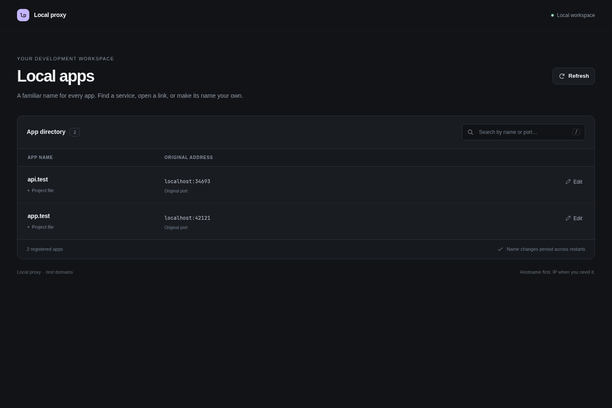
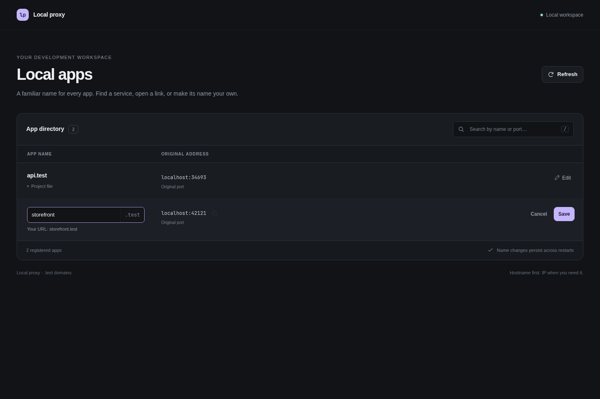
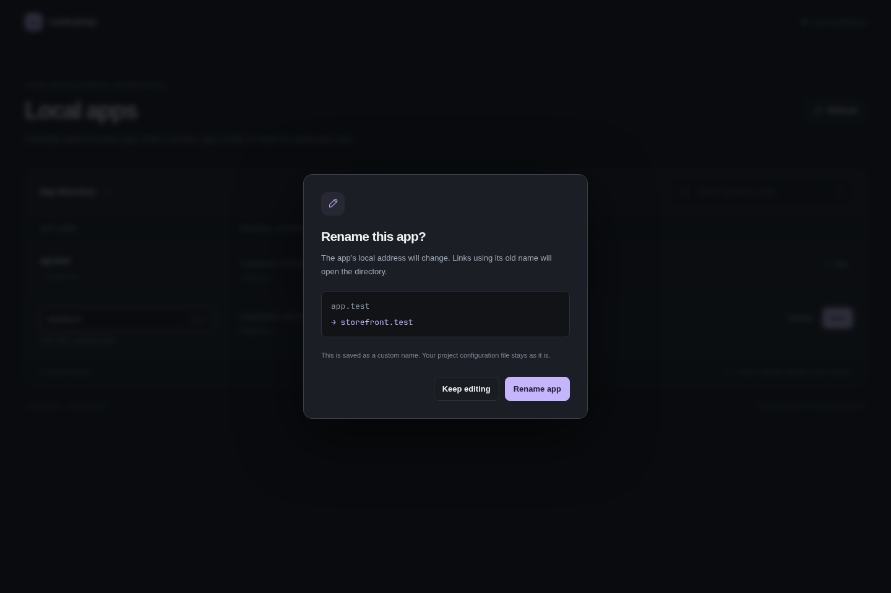
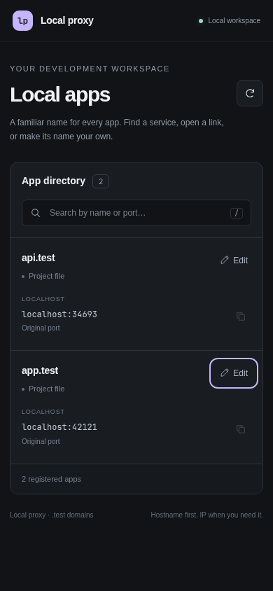

# The directory, in use

These are browser captures of the real Go application, served through Caddy with two working fixture apps. The fixture uses `app.test` and `api.test`, a temporary project file, and dynamically allocated loopback ports. Port numbers in the images will differ from your machine and from the `3000` / `8080` configuration examples.

## Browse your apps

Each app shows its domain, original localhost address, and where its name came from. Search matches either the domain or the port. These fixtures come from `proxy.yaml`, so both rows say “Project file.”



## Edit a name

Choose **Edit**, enter a short name, and review the resulting URL. The suffix stays visible beside the input. Empty names, invalid labels, duplicate names, and the reserved `home` name are rejected before saving.



## Confirm the change

**Save** opens a confirmation that shows the old and new domains. Choosing **Rename app** saves a custom override and reloads Caddy. The original project configuration stays unchanged. After a successful rename, the notification offers **Undo** for 15 seconds.



The capture script opens this confirmation and cancels it. The separate example verifier exercises actual rename, routing changes, revision conflicts, and a rename back; screenshots alone do not establish those behaviors.

## On a phone

The table becomes a stack of cards at narrow widths. Names, original addresses, copy controls, and editing remain available.



## Reproduce the captures

Requirements: a built `bin/localproxy`, Caddy, Python 3, Node.js, `playwright-core`, and Chromium. The capture helper accepts `PLAYWRIGHT_MODULE` as an absolute module path and `CHROMIUM_BIN` as a browser executable path. It also finds `playwright-core` in the project's ignored `.cache/browser-test` directory.

From the repository root, install the browser driver into the ignored cache if needed:

```sh
npm install --prefix .cache/browser-test --no-save playwright-core
```

Start the isolated demo in one terminal. It prints a ready JSON object and writes the same data to the state file:

```sh
python3 scripts/docs-demo.py --state-file .local/docs-capture-state.json
```

After the ready message appears, capture from a second terminal:

```sh
CHROMIUM_BIN=/usr/bin/chromium \
  node scripts/capture-docs.cjs --state .local/docs-capture-state.json
```

To use a browser driver installed elsewhere:

```sh
PLAYWRIGHT_MODULE=/absolute/path/to/node_modules/playwright-core \
CHROMIUM_BIN=/absolute/path/to/chromium \
  node scripts/capture-docs.cjs --state .local/docs-capture-state.json
```

The four PNG files are written to `docs/assets/screenshots/`. Pass `--output .local/capture-review` to keep a review run separate. Stop the demo with **Ctrl-C** when finished; it removes its temporary fixture data, child processes, and state file.

The helper checks search, invalid-name feedback, the rename confirmation, cancellation, mobile overflow, and browser JavaScript errors. It asserts that no write requests are sent and that the registry and project file are byte-for-byte unchanged. Captures contain no Tailnet hostnames, IP addresses, or visible CSRF tokens. Desktop captures use a 1440 × 960 viewport; the mobile viewport is 390 × 844, with full-page capture enabled for both. All four images were captured on September 22, 2026.

## Watch a real rename and Undo

The public site also includes a silent browser recording: [MP4](assets/videos/directory-demo.mp4), [WebM](assets/videos/directory-demo.webm), [poster](assets/videos/directory-demo-poster.png), and [English descriptive captions](assets/videos/directory-demo.en.vtt). It shows the real directory at 1280 × 800: browse the two fixture apps, search for `api`, rename `app.test` to `storefront.test`, review the confirmation, save, and use **Undo**. Captions explain each action; no narration or sound is required.

Unlike the still-image capture, the recording submits the rename and Undo against the disposable fixture. The helper checks both the saved registry and actual Caddy HTTP routing after each change, confirms that the old name falls back to the directory, and checks that `proxy.yaml` stays unchanged. After filming, it restores the original registry and reloads Caddy so the fixture's original project-file naming source is restored too. This recording does not demonstrate system DNS, HTTPS trust, or access from another machine.

Requirements are the same as the screenshots, plus `ffmpeg` with the `libx264` and `libvpx-vp9` encoders. The recorder uses Chromium's DevTools screencast frames and their elapsed capture times; it does not inject a replacement interface or mock API responses.

Start a fresh isolated fixture in one terminal:

```sh
python3 scripts/docs-demo.py --suffix test --state-file .local/docs-video-state.json
```

Once it reports ready, run in a second terminal:

```sh
node scripts/record-docs.cjs --state .local/docs-video-state.json
```

Pass `--output .local/video-review` to keep review exports separate. The same `PLAYWRIGHT_MODULE` and `CHROMIUM_BIN` overrides used by the screenshot helper are supported. Stop the fixture with **Ctrl-C** when done; its processes, temporary registry, and state file are removed. The checked-in video was recorded on September 22, 2026, using temporary localhost ports and no Tailnet links or visible credentials.
